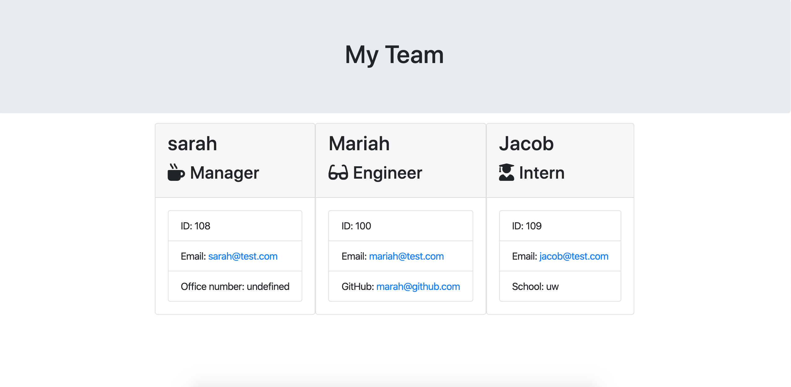

# Team Profile Generator

The purpose of this app is to develop a profile of members of a team.
Inquirer.prompt is used to prompt user to provide specific information about each team member. Each member of the team is an employee. There must be at least one manager, and any number of interns and engineers. Each variety of employee inherits all of the methods from Employee, and has methods specific to their role. The methods are defined in javascript files with classes specific to each type of employee. The methods are exported at the bottom of each file so that they may be used in the app.js file.
 
Once information from all of the employees has been submitted and the user chooses to not add another employee, the function render() is called from the htmlRenderer.js file with the employees array of objects as the argument. This function calls methods specific to each employee to retrieve information about that employee and render html.
 
The rendered html is then written to a file using fs.writeFile(), named team.html, and put in a folder called output.

